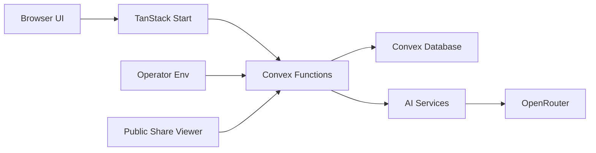

## Executive summary

BuildLedger is an open-source TanStack Start frontend backed by Convex/Confect functions and optional OpenRouter BYOK AI. The highest-risk areas are identity boundaries around project membership, encrypted user AI keys, public share tokens, and deployment configuration for self-hosted instances. Current code has good baseline controls: schema-validated function specs, project membership checks on stateful data, encrypted BYOK storage, hashed share tokens, production Docker runtime, and no client-side raw HTML sinks.

## Scope and assumptions

In scope:
- `apps/web`
- `packages/backend/confect`
- `packages/backend/convex`
- `packages/ai`
- `Dockerfile`, `compose.yaml`, environment docs

Out of scope:
- Convex platform internals.
- External reverse proxy, CDN, and TLS configuration.
- Real OpenRouter service behavior beyond BuildLedger request construction.

Assumptions:
- Single-tenant self-hosted deployments can use the built-in workspace identity.
- Multi-user production deployments set `BUILDLEDGER_AUTH_REQUIRED=enabled` only after configuring a real Convex auth identity provider.
- `BUILDLEDGER_SECRET_KEY` is generated securely, is at least 32 characters, and remains stable per deployment.
- Self-hosters put public deployments behind normal TLS and edge/request controls.

Open questions that could change ranking:
- Whether production will be single-tenant self-hosted or multi-tenant SaaS.
- Whether public share links should expire by default.
- Whether operators will enforce rate limits at Convex/edge for public token resolution.

## System model

### Primary components

- Browser UI: TanStack Start app served from `apps/web`, with runtime Convex URL discovery in `apps/web/src/lib/public-config.ts`.
- Backend API: Confect specs and implementations exported through Convex functions under `packages/backend/confect` and `packages/backend/convex`.
- Data store: Convex tables for projects, memberships, protocols, records, logbook events, AI settings, reports, memory, and share links in `packages/backend/confect/tables/core.ts`.
- AI layer: Effect services in `packages/ai/src/services.ts`, with demo fallback and OpenRouter adapter.
- Deployment: Docker production image runs Nitro output as non-root user from `Dockerfile`.

### Data flows and trust boundaries

- Browser -> TanStack Start UI: rendered text, forms, and button actions over HTTP/S. React escapes normal text rendering; no raw HTML sink was found.
- Browser -> Convex functions: project, protocol, record, AI settings, report, and share requests. Function specs validate inputs through Effect Schema / Confect specs.
- Convex functions -> Convex database: persisted projects, memberships, keys, reports, and tokens. Access control is enforced before project-scoped reads/writes.
- Convex action -> OpenRouter: prompts and user-selected model cross to an external AI provider only when a user or environment key exists.
- Public viewer -> share token resolver: token crosses a public boundary; only a SHA-256 token hash is stored.
- Operator -> environment: deployment settings and secrets enter through environment variables and Convex deployment config.

#### Diagram

## Assets and security objectives

| Asset | Why it matters | Security objective |
| --- | --- | --- |
| Project and protocol data | Construction project history, decisions, risks, tasks, concerns, and obstructions | C/I/A |
| Project memberships | Authorization boundary for project data | C/I |
| OpenRouter API keys | User or operator-funded AI credentials | C/I |
| Share tokens | Public read access capability | C/I |
| AI prompts and generated output | May contain confidential project context | C/I |
| Docker/build artifacts | Public deployment supply chain | I/A |

## Attacker model

### Capabilities

- Anonymous web user can load the frontend and call public Convex functions.
- Signed-in user can create project data and attempt cross-project access.
- Public share-link holder can resolve a valid token.
- Malicious self-host operator can misconfigure environment variables.

### Non-capabilities

- Cannot read Convex storage directly without platform/operator access.
- Cannot decrypt BYOK keys without `BUILDLEDGER_SECRET_KEY`.
- Cannot exploit TypeScript types alone; runtime validation happens in Confect specs.

## Entry points and attack surfaces

| Surface | How reached | Trust boundary | Notes | Evidence |
| --- | --- | --- | --- | --- |
| Project functions | Browser -> Convex | User to backend | Optional list, protected create/get/archive | `packages/backend/confect/projects.impl.ts:17`, `:48`, `:96` |
| Protocol functions | Browser -> Convex | User to backend | Project access checked before protocol operations | `packages/backend/confect/protocols.impl.ts`, `packages/backend/confect/protocols/` |
| AI settings | Browser -> Convex | User to backend secrets | Raw keys encrypted and never returned publicly | `packages/backend/confect/ai-settings.impl.ts:37`, `:138`, `:272` |
| AI actions | Browser -> Convex action -> OpenRouter | Backend to third-party | Provider resolved centrally | `packages/backend/confect/ai.impl.ts:18`, `packages/ai/src/services.ts:86` |
| Share tokens | Public token -> Convex | Anonymous to backend | Token hash stored; raw token returned once | `packages/backend/confect/shares.impl.ts:24`, `:40`, `:123` |
| Runtime config | Env -> web/backend | Operator to runtime | Public Convex URL is browser-safe; key env stays backend-side | `docs/environment.md:35`, `apps/web/src/lib/public-config.ts:7` |

## Top abuse paths

1. Cross-project access: attacker obtains another project id -> calls project/protocol/record/report functions -> membership check blocks access.
2. BYOK key theft: attacker opens AI settings -> public read returns only provider, model, and key last-4 -> raw key remains encrypted backend-side.
3. Share token guessing: attacker brute-forces public token resolver -> token is high entropy and stored hashed -> practical guessing remains low likelihood.
4. Missing auth in multi-user production: operator exposes one public instance without `BUILDLEDGER_AUTH_REQUIRED=enabled` and a real identity provider -> all users share the self-hosted workspace boundary.
5. Prompt data exposure: project memory is sent to OpenRouter when a real key is configured -> operator/user must treat provider as a third-party processor.
6. Client XSS: attacker stores malicious content in notes -> React renders as text and no raw HTML sink is present.

## Threat model table

| Threat ID | Threat source | Prerequisites | Threat action | Impact | Impacted assets | Existing controls | Gaps | Recommended mitigations | Detection ideas | Likelihood | Impact severity | Priority |
| --- | --- | --- | --- | --- | --- | --- | --- | --- | --- | --- | --- | --- |
| TM-001 | Authenticated user | Attacker knows or guesses another project id | Calls project-scoped functions directly | Unauthorized project data access | Projects, protocols, records, memory | `ensureProjectAccess` verifies membership in `packages/backend/confect/helpers.ts`; functions call it before scoped access | Requires every new function to keep using helper | Keep all project-scoped functions behind `ensureProjectAccess`; add tests for cross-project denial when test harness supports auth identities | Convex errors for forbidden access by function name | Low | High | Medium |
| TM-002 | Anonymous internet user | Valid public share token or brute-force attempts | Resolves share token repeatedly | Public read access or availability pressure | Share tokens, shared resources | Tokens are `nanoid(32)` and stored as SHA-256 hashes in `shares.impl.ts:73` and `:24` | No app-level rate limit visible in repo; no default expiry | Add optional default expiry and edge/Convex rate limiting for token resolution | Log invalid token resolution counts | Low | Medium | Low |
| TM-003 | Malicious web user | XSS sink or raw HTML rendering exists | Stores script in notes/project fields | Browser session compromise | Browser UI, visible project data | Security scan found no `dangerouslySetInnerHTML` or DOM injection sink in app code; React text rendering is used | CSP/security headers are deployment-dependent | Add deployment security-header guidance or Nitro header config if hosting layer does not provide it | Browser CSP violation reports if enabled | Low | High | Medium |
| TM-004 | Misconfigured operator | Public multi-user deployment without auth-required mode | Leaves the built-in self-hosted workspace identity active | Cross-user data exposure within that deployment | Project data, BYOK settings | Env docs describe `BUILDLEDGER_AUTH_REQUIRED=enabled`; helper requires auth when that flag is enabled | Hosting must still configure Better Auth or another Convex-compatible provider for multi-user deployments | Add startup/deploy checklists that distinguish single-tenant self-hosting from public multi-user deployments | Startup/deploy config check | Medium | High | High |
| TM-005 | External AI provider or compromised key | OpenRouter configured through env or BYOK | Receives project prompts and generated context | Data disclosure to AI provider | Protocol sources, memory, reports | Demo provider is default; BYOK key encrypted with AES-GCM in `ai-settings.impl.ts`; raw key is not returned publicly | No provider-level DLP controls in app | Document provider data exposure and allow demo/no-key mode for sensitive deployments | Audit AI action usage by provider source | Medium | Medium | Medium |

## Criticality calibration

- Critical: unauthenticated raw key disclosure, pre-auth RCE, or cross-tenant data access without project membership checks.
- High: production dev-auth exposure, systematic project authorization bypass, or leaked `BUILDLEDGER_SECRET_KEY`.
- Medium: missing share expiry/rate limiting, third-party AI data exposure without operator awareness, missing deployment headers.
- Low: non-sensitive metadata disclosure, invalid token noise, or issues requiring local-only configuration mistakes.

## Focus paths for security review

| Path | Why it matters | Related Threat IDs |
| --- | --- | --- |
| `packages/backend/confect/helpers.ts` | Central auth and project authorization boundary | TM-001, TM-004 |
| `packages/backend/confect/ai-settings.impl.ts` | BYOK encryption, decryption, and public settings boundary | TM-005 |
| `packages/backend/confect/shares.impl.ts` | Public token creation and resolution | TM-002 |
| `packages/backend/confect/protocols/` | Protocol state transitions and memory publication | TM-001, TM-005 |
| `packages/backend/confect/reports.impl.ts` | Report generation and project memory use | TM-001, TM-005 |
| `packages/ai/src/services.ts` | Provider selection, prompts, schema decoding | TM-005 |
| `apps/web/src/components/ai-settings-sheet.tsx` | User-facing key entry and raw-key non-disclosure | TM-005 |
| `Dockerfile` | Production runtime shape and non-root container | TM-004 |
| `docs/environment.md` | Operator security-critical configuration | TM-004, TM-005 |

## Quality check

- Covered discovered runtime entry points: projects, protocols, records, AI settings/actions, reports, memory, shares, web runtime config.
- Covered each trust boundary at least once in threats.
- Separated runtime concerns from Docker/dev tooling.
- Proceeded with explicit assumptions because the requested task asked to verify and commit in this turn.
- Open questions are documented where they could change risk ranking.
