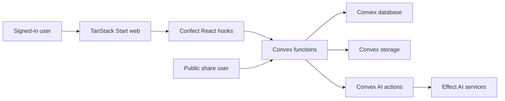

# Security Audit

Date: 2026-05-22

## Executive Summary

BuildLedger is a Convex-first TanStack Start app with Confect schemas at the backend boundary and Effect services for AI/domain logic. The final hardening pass found no remaining known dependency vulnerabilities and no authored-source use of unsafe DOM sinks, `any`, TypeScript suppression comments, `console.log`, committed secrets, or client-side secret storage.

## Scope

In scope:

- `apps/web`
- `packages/backend/confect`
- `packages/ai`
- `packages/design-system/src/charts`
- `packages/design-system/src/hooks`
- `packages/testing`
- root package, workspace, and docs configuration

Out of scope:

- generated Confect and TanStack files
- vendored Coss UI registry components
- vendored Evil Charts registry components
- infrastructure security headers that must be verified at the deployment edge

## Documentation And Guidance Used

- Convex best practices: https://docs.convex.dev/understanding/best-practices/
- Convex error handling: https://docs.convex.dev/functions/error-handling/
- Convex TanStack Start client: https://docs.convex.dev/client/tanstack/tanstack-start/
- Convex runtime docs: https://docs.convex.dev/functions/runtimes
- Effect configuration docs: https://effect.website/docs/configuration/
- Effect schema advanced usage: https://effect.website/docs/schema/advanced-usage/
- Local security-best-practices skill references for React and browser TypeScript
- Local security-threat-model skill prompt and control references
- Local Codex Security scan workflow

## Findings Fixed

| ID | Severity | Area | Fix |
| --- | --- | --- | --- |
| SA-001 | Medium | Share links | Replaced plaintext-style token storage with SHA-256 token hashing before persistence. |
| SA-002 | Medium | Share links | Changed public token resolution from reactive query to mutation so expiry checks use fresh time. |
| SA-003 | Medium | Share links | Added target ownership checks before creating links for meetings or reports. |
| SA-004 | Medium | Dependencies | Removed unused `geist` dependency and added a workspace override for patched `ws@8.20.1`. |
| SA-005 | Low | Backend typing | Removed unsafe error-normalizer casts and replaced breakpoint casts with type guards. |
| SA-006 | Low | Project docs/assets | Removed scaffold README text and corrected the app manifest to BuildLedger branding. |

## Threat Model Summary

| Trust Boundary | Data | Existing Controls | Main Risk |
| --- | --- | --- | --- |
| Browser to Convex functions | project, meeting, report, share payloads | Confect args/returns schemas and Convex auth identity checks | access-control regression |
| Public share token to Convex | opaque token | random token plus stored SHA-256 hash and revoke/expiry checks | token leakage or weak token handling |
| Convex functions to database | project memory and generated records | explicit table schemas, indexes, and project membership checks | cross-project reads/writes |
| Convex AI actions to Effect services | meeting text and memory chunks | typed Effect services and tagged errors | prompt/data leakage once real provider is added |

## Residual Risks And Next Controls

- Production security headers are not visible in this repo. Verify CSP, `frame-ancestors`, `nosniff`, and referrer policy at the deployment edge.
- AI provider integration is currently deterministic demo logic. When a real provider is added, keep secrets server-side and add request budgets, prompt logging redaction, and provider error mapping.
- Share links currently resolve only link metadata. Public read-only resource views should resolve exactly one resource type and never expose project-wide data.
- High-volume project memory should move from capped `.take(...)` reads to paginated views or aggregates when production scale requires it.

## Verification

- `pnpm audit --audit-level moderate`
- unsafe-source search for DOM sinks, `any`, TypeScript suppression comments, debug logging, and client storage
- dependency tree review for `geist` and `ws`
